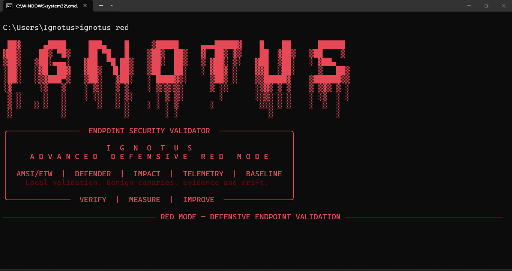
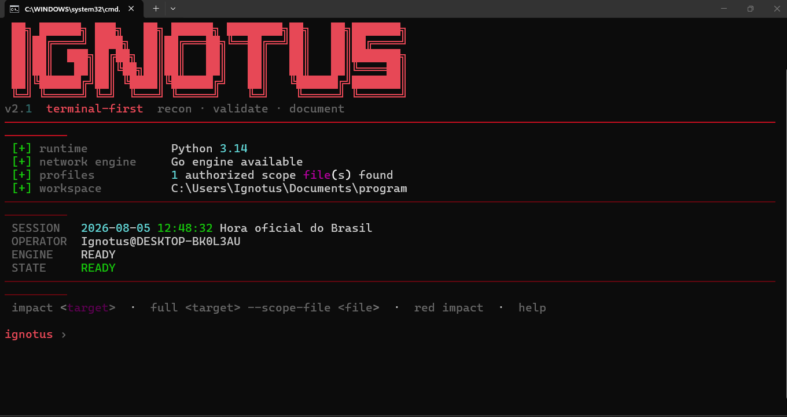

## Advanced Reconnaissance & Vulnerability Evidence Collection Framework




## AMSI avançado defensivo

O modo AMSI é uma auditoria nativa do Windows com identidade visual vermelha.
Ele valida `amsi.dll`, provedores registrados, Microsoft Defender, chamada real
de `AmsiScanString` e políticas de telemetria. Não implementa bypass ou malware.

```powershell
python main.py --amsi-audit
```

Os resultados são exportados para `output/amsi/`. Veja `docs/AMSI_AUDIT.md`.

## Purple Team seguro (somente terminal)


O modo Purple Team é local e independente do scanner. Ele usa canários benignos,
visíveis e temporários para gerar telemetria e mapear cobertura de detecções, sem
malware, evasão, persistência ou execução remota.

```powershell
python main.py --purple-team --purple-profile all
python main.py --purple-team --purple-profile all `
  --purple-detections config/purple/detections.json
```

Os relatórios JSON e Markdown são gravados em `output/purple/`. Consulte
`docs/PURPLE_TEAM.md` para os perfis, o catálogo ATT&CK e o formato das regras.


---

## Ignotus 2.1 — arquitetura híbrida

O Ignotus usa Python para orquestração, terminal, análise e relatórios, com um
motor Go opcional para o preflight concorrente de DNS, HTTP e portas. O fallback
Python permanece disponível e é selecionado automaticamente quando o binário Go
não existe.

Um scan de alvo só inicia em um dos dois modos explícitos:

```powershell
python main.py https://alvo.example --only-impacts
python main.py https://alvo.example --full --scope-file config/scopes/alvo.txt
```

`--only-impact` é aceito como alias. O modo completo não habilita testes de
indisponibilidade. `--werkzeug-dos` continua separado, explícito e exige escopo.

Recursos de execução:

- `--engine auto|python|go` para selecionar o motor;
- `--rate-limit 10` para limitar inícios de pipelines por segundo;
- `--scan-timeout 900` para definir o prazo global;
- `--resume` para retomar hosts presentes no checkpoint;
- checkpoints sanitizados em `output/checkpoints/`;
- grafo de ativos em `output/json/*_asset_graph.json`.

Para compilar e testar o motor Go no Windows:

```powershell
.\build_engine.bat
```

Veja também `docs/ARCHITECTURE.md` e `SECURITY_MODES.md`.

---

# 1. Visão Geral

O **Ignotus Recon** é uma ferramenta avançada de reconhecimento de superfície de ataque, análise de infraestrutura e coleta de evidências técnicas.

O projeto foi desenvolvido com foco em:

- Bug Bounty;
- Pentest autorizado;
- Security Research;
- Auditoria de exposição externa;
- Análise de ativos públicos.

O objetivo principal do Ignotus não é apenas encontrar subdomínios ou IPs, mas criar um contexto técnico completo sobre cada ativo encontrado.

A ferramenta realiza:

- enumeração de subdomínios;
- análise DNS;
- fingerprint de infraestrutura;
- identificação de CDN/WAF;
- análise de Cloud Provider;
- identificação tecnológica;
- análise TLS;
- análise ASN;
- análise de possíveis exposições;
- coleta de evidências.


---

# 2. Filosofia do Projeto

Ferramentas tradicionais normalmente retornam apenas dados:

```
subdominio.com
IP
porta aberta
header HTTP
```

O Ignotus tem como objetivo transformar esses dados em inteligência:

```
Ativo encontrado

↓

Quem hospeda?

↓

Qual tecnologia usa?

↓

Está atrás de CDN?

↓

Existe exposição?

↓

Existe evidência para comprovação?
```

A ferramenta funciona como uma camada de correlação entre diversas informações.


---

# 3. Objetivos

## Objetivos principais

- Reduzir falsos positivos;
- Criar contexto sobre ativos;
- Identificar infraestrutura real;
- Gerar evidências técnicas;
- Facilitar análise manual;
- Auxiliar relatórios de vulnerabilidades.


## Não é objetivo

O Ignotus não substitui:

- scanners de vulnerabilidade completos;
- exploração automática;
- ferramentas de ataque.

Ele é uma ferramenta de reconhecimento e análise.


---

# 4. Arquitetura do Projeto


```
ingotus/

├── main.py
├── cli.py
├── requirements.txt
├── README.md
├── LICENSE
├── .gitignore

├── core/
│   ├── logger.py
│   ├── config.py
│   ├── models.py
│   ├── exceptions.py
│   ├── cache.py
│   ├── fingerprint.py
│   ├── classifier.py
│   ├── evidence.py
│   └── engine.py

├── modules/
│   ├── subdomains.py
│   ├── dns.py
│   ├── http.py
│   ├── tls.py
│   ├── reverse.py
│   ├── asn.py
│   ├── ports.py
│   ├── technologies.py
│   └── takeover.py

├── providers/
│   ├── crtsh.py
│   ├── alienvault.py
│   ├── hackertarget.py
│   ├── rapiddns.py
│   └── securitytrails.py

├── fingerprints/

│   ├── cdn.json
│   ├── waf.json
│   ├── cloud.json
│   └── technologies.json

├── database/

│   └── ingotus.db


├── evidence/

│   ├── requests/
│   ├── responses/
│   └── screenshots/


├── output/

│   ├── json/
│   └── markdown/


├── wordlists/

│   ├── subdomains.txt
│   └── technologies.txt


└── docs/

    ├── architecture.md
    ├── fingerprints.md
    └── usage.md
```

---

# 5. Módulos do Sistema


# Core

Responsável pela lógica principal.


## models.py

Define os modelos de dados utilizados pelo sistema.

Exemplos:

- Host;
- IP;
- DNS;
- TLS;
- Fingerprint;
- Evidence.


Evita trabalhar com vários dicionários espalhados.


---

## fingerprint.py

Motor de identificação de infraestrutura.


Analisa:

- ASN;
- Reverse DNS;
- TLS;
- HTTP Headers;
- CNAME;
- IP Range.


Exemplo:

```
ASN:

AS15169


Provider:

Google LLC


Resultado:

Google Edge


Confidence:

98%
```

---

## classifier.py

Responsável pela classificação final.


Possíveis resultados:


```
EDGE

CDN

WAF

LOAD BALANCER

ORIGIN

UNKNOWN
```


---

## evidence.py

Gerenciamento de evidências.


Armazena:


- respostas HTTP;
- headers;
- certificados;
- informações DNS;
- resultados de fingerprint.


---

## cache.py

Sistema de cache.


Evita consultas repetidas:

- DNS;
- Reverse DNS;
- HTTP;
- TLS.


---

# 6. Enumeração de Subdomínios


O Ignotus utiliza múltiplas fontes:


- Certificate Transparency;
- crt.sh;
- AlienVault OTX;
- HackerTarget;
- RapidDNS.


Entrada:


```
empresa.com
```


Saída:


```
api.empresa.com

dev.empresa.com

portal.empresa.com

mail.empresa.com
```


---

# 7. Análise DNS


O módulo DNS coleta:


- A;
- AAAA;
- CNAME;
- MX;
- NS;
- TXT.


Exemplo:


```
Host:

api.exemplo.com


IPv4:

192.0.2.10


CNAME:

edge.provider.com
```


---

# 8. Fingerprint de Infraestrutura


O Ignotus não depende apenas de headers.


Exemplo:


Um servidor responde:


```
Server:

sffe
```


O sistema verifica:


```
ASN

Reverse DNS

TLS

CNAME

IP Range
```


Resultado:


```
Provider:

Google


Classification:

Google Edge


Confidence:

99%
```


---

# 9. CDN / WAF Detection


Detecta:


## CDN

- Cloudflare;
- Akamai;
- Fastly;
- CloudFront;
- Google Edge;
- Azure Front Door.


## WAF

- Cloudflare WAF;
- Imperva;
- Sucuri;
- AWS Shield.


A identificação usa:


- headers;
- DNS;
- ASN;
- TLS;
- fingerprints.


---

# 10. Origin Exposure Analysis


O Ignotus não considera:


```
IP público = vazamento
```


Essa abordagem gera falsos positivos.


A análise considera:


- CDN presente;
- ASN;
- histórico DNS;
- fingerprint;
- infraestrutura.


Possíveis resultados:


```
DIRECT ORIGIN

PROTECTED

UNKNOWN
```


---

# 11. TLS Analysis


Coleta:


- certificado;
- emissor;
- validade;
- SAN;
- organização.


Exemplo:


```
Issuer:

Google Trust Services


Status:

Valid
```


---

# 12. ASN Intelligence


Identifica:


- proprietário do IP;
- organização;
- rede.


Exemplo:


```
IP:

142.250.x.x


ASN:

AS15169


Organization:

Google LLC
```


---

# 13. Port Scanner


Scanner de portas comuns.


Exemplo:


```
21

22

25

53

80

443

3306

5432

8080

8443
```


Objetivo:

Identificar serviços expostos.


---

# 14. Technology Detection


Identifica tecnologias:


Exemplo:


```
Nginx

Apache

IIS

Laravel

WordPress

React

Next.js

Django
```


---

# 15. Subdomain Takeover Detection


Analisa:


- CNAME abandonado;
- serviços removidos;
- recursos inexistentes.


Possíveis resultados:


```
Potential Takeover

No Issue

Unknown
```


---

# 16. Sistema de Evidências


O Ignotus foi criado para auxiliar comprovação de vulnerabilidades.


Estrutura:


```
evidence/

├── requests/

├── responses/

└── screenshots/
```


Exemplos:


```
headers.txt

response.txt

certificate.json

dns.json
```


---

# 17. Banco de Dados


SQLite será utilizado para armazenar:


- targets;
- subdomínios;
- IPs;
- fingerprints;
- histórico;
- evidências.


Permite:


- comparar scans;
- identificar mudanças;
- acompanhar ativos.


---

# 18. Formato de Saída


## JSON


Exemplo:


```json
{
 "host":"api.example.com",
 "provider":"Cloudflare",
 "classification":"CDN",
 "confidence":98
}
```


## Markdown


Usado para análise humana.


---

# 19. Execução


Instalação:


```
pip install -r requirements.txt
```


Execução:


```
python main.py dominio.com
```

Terminal interativo recomendado:

```
python main.py --interactive
```

No Windows, também é possível abrir `iniciar_ignotus.bat` para preparar o
ambiente local e iniciar o mesmo assistente.

O teste intrusivo de DoS do Werkzeug só é executado com `--werkzeug-dos`, sempre
acompanhado de `--scope-file`. Nem `--full` nem `--only-impacts` habilitam esse
teste implicitamente.


Sem scan de portas:


```
python main.py dominio.com --no-portscan
```


Alterar workers:


```
python main.py dominio.com --workers 80
```


---

# 20. Futuras Integrações


Planejado:


- Nmap;
- Nuclei;
- httpx;
- Katana;
- Burp Suite;
- Shodan;
- Censys;
- VirusTotal.


---

# 21. Responsabilidade


Use o Ignotus somente em:


- sistemas próprios;
- ambientes autorizados;
- programas Bug Bounty permitidos;
- contratos de teste.


O usuário é responsável pela autorização do alvo.


---

# Licença

MIT License
